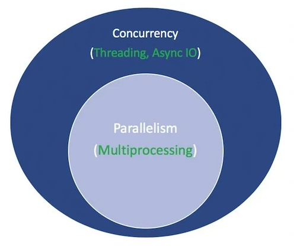

# Async IO in Python: A Complete Walkthrough
https://realpython.com/async-io-python/

### useful links  
https://docs.python.org/3/library/concurrency.html
https://docs.python.org/3/library/asyncio.html

Here’s what you’ll cover:

- Asynchronous IO (async IO): a language-agnostic paradigm (model) that has implementations across a host of programming languages

- async/await: two new Python keywords that are used to define coroutines

- asyncio: the Python package that provides a foundation and API for running and managing coroutines

## Where Does Async IO Fit In?

Concurrency and parallelism are expansive subjects that are not easy to wade into. While this article focuses on async IO and its implementation in Python, it’s worth taking a minute to compare async IO to its counterparts in order to have context about how async IO fits into the larger, sometimes dizzying puzzle.

**Parallelism** consists of performing multiple operations at the same time. `Multiprocessing` is a means to effect parallelism, and it entails spreading tasks over a computer’s central processing units (CPUs, or cores). Multiprocessing is well-suited for CPU-bound tasks: tightly bound for loops and mathematical computations usually fall into this category.

**Concurrency** is a slightly broader term than parallelism. It suggests that multiple tasks have the ability to run in an overlapping manner. (There’s a saying that concurrency does not imply parallelism.)

**Threading** is a concurrent execution model whereby multiple threads take turns executing tasks. One process can contain multiple threads. Python has a complicated relationship with threading thanks to its GIL, but that’s beyond the scope of this article.

What’s important to know about threading is that it’s better for IO-bound tasks. While a CPU-bound task is characterized by the computer’s cores continually working hard from start to finish, an IO-bound job is dominated by a lot of waiting on input/output to complete.

## TO RECAP ...
To recap the above, concurrency encompasses both multiprocessing (ideal for CPU-bound tasks) and threading (suited for IO-bound tasks). Multiprocessing is a form of parallelism, with parallelism being a specific type (subset) of concurrency. The Python standard library has offered longstanding support for both of these through its multiprocessing, threading, and concurrent.futures packages.

The `asyncio` package is billed by the Python documentation as a library to write concurrent code. However, async IO is not threading, nor is it multiprocessing. It is not built on top of either of these.
https://docs.python.org/3/library/asyncio.html


In fact, async IO is a single-threaded, single-process design: it uses **cooperative multitasking**, a term that you’ll flesh out by the end of this tutorial. It has been said in other words that async IO gives a feeling of concurrency despite using a single thread in a single process. Coroutines (a central feature of async IO) can be scheduled concurrently, but they are not inherently concurrent.

To reiterate, `async IO` is a style of concurrent programming, **but it is not parallelism**. It’s more closely aligned with threading than with multiprocessing but is very much distinct from both of these and is a standalone member in concurrency’s bag of tricks.

That leaves one more term. What does it mean for something to be asynchronous? This isn’t a rigorous definition, but for our purposes here, I can think of two properties:

1. Asynchronous routines are able to “pause” while waiting on their ultimate result and let other routines run in the meantime.
2. Asynchronous code, through the mechanism above, facilitates concurrent execution. To put it differently, asynchronous code gives the look and feel of concurrency.

Here’s a diagram to put it all together. The white terms represent concepts, and the green terms represent ways in which they are implemented or effected:



## The `asyncio` Package and `async/await`

Now that you have some background on async IO as a design, let’s explore Python’s implementation. Python’s `asyncio` package (introduced in Python 3.4) and its two keywords, `async` and `await`, serve different purposes but come together to help you declare, build, execute, and manage asynchronous code.

At the heart of async IO are **coroutines**. A coroutine is a specialized version of a Python generator function. Let’s start with a baseline definition and then build off of it as you progress here: 
a **coroutine** is a function that can suspend its execution before reaching `return`, and it can indirectly pass control to another coroutine for some time

Let’s take the immersive approach and write some async IO code. This short program is the Hello World of async IO but goes a long way towards illustrating its core functionality:


## The Rules of Async IO
At this point, a more formal definition of async, await, and the coroutine functions that they create are in order. This section is a little dense, but getting a hold of async/await is instrumental, so come back to this if you need to:

1. The syntax async def introduces either a native coroutine or an asynchronous generator. The expressions async with and async for are also valid, and you’ll see them later on.

2. The keyword await passes function control back to the event loop. (It suspends the execution of the surrounding coroutine.) If Python encounters an await f() expression in the scope of g(), this is how await tells the event loop, “Suspend execution of g() until whatever I’m waiting on—the result of f()—is returned. In the meantime, go let something else run.”

In code, that second bullet point looks roughly like this:
```py
async def g():
    # Pause here and come back to g() when f() is ready
    r = await f()
    return r
```

Here are some terse examples meant to summarize the above few rules:
```py
async def f(x):
    y = await z(x)  # OK - `await` and `return` allowed in coroutines
    return y

async def g(x):
    yield x  # OK - this is an async generator

async def m(x):
    yield from gen(x)  # No - SyntaxError

def m(x):
    y = await z(x)  # Still no - SyntaxError (no `async def` here)
    return y
```

These two coroutines are essentially equivalent (both are awaitable), but the first is generator-based, while the second is a native coroutine:

```py
import asyncio

@asyncio.coroutine
def py34_coro():
    """Generator-based coroutine, older syntax"""
    yield from stuff()

async def py35_coro():
    """Native coroutine, modern syntax"""
    await stuff()
```

If you’re writing any code yourself, prefer native coroutines for the sake of being explicit rather than implicit. Generator-based coroutines will be removed in Python 3.10.


## Async IO’s Roots in Generators

```py
import asyncio

@asyncio.coroutine
def py34_coro():
    """Generator-based coroutine"""
    # No need to build these yourself, but be aware of what they are
    s = yield from stuff()
    return s

async def py35_coro():
    """Native coroutine, modern syntax"""
    s = await stuff()
    return s

async def stuff():
    return 0x10, 0x20, 0x30

```

As an experiment, what happens if you call `py34_coro()` or `py35_coro()` on its own, without `await`, or without any calls to `asyncio.run()` or other asyncio “porcelain” functions? Calling a coroutine in isolation returns a coroutine object:

```bash
>>> py35_coro()
<coroutine object py35_coro at 0x10126dcc8>

```

This isn’t very interesting on its surface. The result of calling a coroutine on its own is an awaitable **coroutine object**.

Time for a quiz: what other feature of Python looks like this? (What feature of Python doesn’t actually “do much” when it’s called on its own?)

Hopefully you’re thinking of **generators** as an answer to this question, because coroutines are enhanced generators under the hood. The behavior is similar in this regard:
```py
>>> def gen():
...     yield 0x10, 0x20, 0x30
...
>>> g = gen()
>>> g  # Nothing much happens - need to iterate with `.__next__()`
<generator object gen at 0x1012705e8>
>>> next(g)
(16, 32, 48)
````