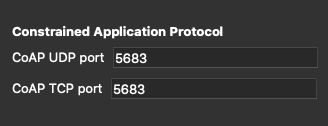

# Useful links
<!-- Following link is the mai article resource  -->
https://realpython.com/python-https/

https://en.wikipedia.org/wiki/Transmission_Control_Protocol
https://www.restapitutorial.com/
https://developer.mozilla.org/en-US/docs/Web/HTTP/Overview

# Environment steps 
1. pip install -r requirements.txt

# HowTo... and Tip&Tricks 

## Run uwsgi
<!-- doesn't use port 5683 it associated to Co -->

uwsgi --http-socket 127.0.0.1:5985 --mount /=server:app

