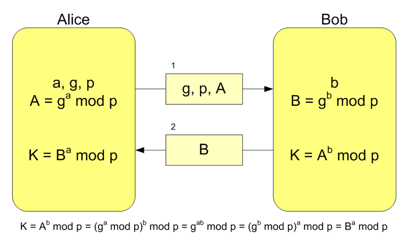

# Exploring HTTPS With Python
> by Logan Jones  Jan 08, 2020 10 Comments  intermediate web-dev
<!-- Following link is the mai article resource  -->
https://realpython.com/python-https/

# Useful links
https://robertheaton.com/2014/03/27/how-does-https-actually-work/

http://www.di-srv.unisa.it/~ads/corso-security/www/CORSO-9900/SSL/main.htm

https://en.wikipedia.org/wiki/Diffie%E2%80%93Hellman_key_exchange#Cryptographic_explanation

https://en.wikipedia.org/wiki/Transmission_Control_Protocol

https://www.restapitutorial.com/

https://developer.mozilla.org/en-US/docs/Web/HTTP/Overview


# Environment steps 
1. pip install -r requirements.txt

# HowTo... and Tip&Tricks 

## Install uwsgi
Although `uwsgi` shall install via "pip" on MacOs I had some issues, and to solve it I preferred install it via `brew`

```bash
brew install uwsgi
```
>optional

```bash
brew unlink openssl && brew link openssl --force
```

## Run uwsgi server and client app ( on HTTP )

I don't use port 5683 becauce it associated to Constrained Application Protocol (CoAP) into WireShark 


now to run server type this on a `shell` terminal

```bash
uwsgi --http-socket 127.0.0.1:5985 --mount /=server:app
```
and to launch a client via `browser` type

```bash
http://localhost:5985/
```

or via shell by `curl` type 

```bash
curl localhost:5985/
```

## Using Cryptography
https://en.wikipedia.org/wiki/Symmetric-key_algorithm

The previous exmaple shows through  Wireshark the plain content-text, now 
try using cryptography 

to generate a random and secure key type from python-shell

```python
from cryptography.fernet import Fernet
key = Fernet.generate_key()
key
```

and using it as follow :

```python
my_cipher = Fernet(key)
ciphertext = my_cipher.encrypt(b"fluffy tail")
ciphertext
```

noe running server and client with symmetric chiper

### server-side
```bash
uwsgi --http-socket 127.0.0.1:5985 \
    --env SECRET_KEY="8jtTR9QcD-k3RO9Pcd5ePgmTu_itJQt9WKQPzqjrcoM=" \
    --mount /=symmetric_server:app

uwsgi --plugin python,http --http-socket 127.0.0.1:5985 \
    --env SECRET_KEY="8jtTR9QcD-k3RO9Pcd5ePgmTu_itJQt9WKQPzqjrcoM=" \
    --mount /=symmetric_server:app

```
### client-side
```bash
SECRET_KEY="8jtTR9QcD-k3RO9Pcd5ePgmTu_itJQt9WKQPzqjrcoM=" python symmetric_client.py
```
Awesome! 

Your data is safe! But wait a minute—you never had to know anything about a key 
when you were using Python HTTPS applications before. 

That’s because HTTPS doesn’t use symmetric encryption exclusively. 
As it turns out, sharing secrets is a hard problem.

## How Are Keys Shared?

What you need is for two parties that have never communicated to have a shared secret. Sounds impossible, right? Luckily, three guys by the names of Ralph Merkle, Whitfield Diffie, and Martin Hellman have your back. They helped demonstrate that public-key cryptography, otherwise known as asymmetric encryption, was possible.

https://en.wikipedia.org/wiki/Public-key_cryptography

**Asymmetric encryption** allows for two users who have never communicated before to share a common secret. 
One of the easiest ways to understand the fundamentals is to use a color analogy.

https://en.wikipedia.org/wiki/Diffie%E2%80%93Hellman_key_exchange#Cryptographic_explanation




Another common name for this sequence of events is the **Diffie-Hellman** key exchange. 
The key exchange is made up of the following parts:

The **private key** is your private color from the examples.
The **public key** is the combined color that you shared.

When you’re communicating over a secure website, like this one, your browser and the server set up a secure communication using these same principles:

1. Your browser **requests** information from the server.
2. Your browser and the server **exchange** public keys.
3. Your browser and the server **generate** a shared private key.
4. Your browser and the server **encrypt and decrypt** messages using this shared key through symmetric encryption.

# What Is HTTPS Like in the Real World?

Encryption is only half of the story. 
When visiting a secure website, there are two major components needed:

1. **Encryption** converts plaintext to ciphertext and back.
2. **Authentication** verifies that a person or thing is who they say they are.

You’ve heard extensively about how encryption works, but what about authentication? To understand authentication in the real world, you’ll need to know about **Public Key Infrastructure.** PKI introduces another important concept into the security ecosystem, called **certificates**.

Certificates are like passports for the Internet. Like most things in the computer world, they are just chunks of data in a file. Generally speaking, certificates include the following information:

* **Issued To:** identifies who owns the certificate
* **Issued By:** identifies who issued the certificate
* **Validity Period:** identifies the time frame for which the certificate is valid


Just like passports, certificates are only really useful if they’re generated and recognized by some authority. It’s impractical for your browser to know about every single certificate of every site you visit on the Internet. Instead, PKI relies on a concept known as **Certificate Authorities (CA)**.

Certificate Authorities are responsible for issuing certificates. They are considered a trusted third party (**TTP**) in PKI. Essentially, these entities act as valid authorities for a certificate. Suppose you’d like to visit another country, and you have a passport with all your information on it. How do the immigration officers in the foreign country know that your passport contains valid information?

If you were to fill out all the information yourself and sign it, then each immigration officer in each country you want to visit would need to know you personally and be able to attest that the information there was indeed correct.

Another way to handle this is to send all your information into a Trusted Third Party (TTP). The TTP would do a thorough investigation of the information you provided, verify your claims, and then sign your passport. This turns out to be much more practical because the immigration officers only need to know the trusted third parties.

### Trusted Third Party _scenario_
The _TTP scenario_ is how certificates are handled in practice. The process goes something like this:

1. **Create a Certificate Signing Request (CSR)**: This is like filling out the information for your visa.
2. **Send the CSR to a Trusted Third Party (TTP)**: This is like sending your information into a visa application office.
3. **Verify your information**: Somehow, the TTP needs to verify the information you provided. As an example, see how Amazon validates ownership.
4. **Generate a Public Key**: The TTP signs your CSR. This is equivalent to the TTP signing your visa.
5. **Issue the verified Public Key**: This is equivalent to you receiving your visa in the mail.

>Note that the CSR is tied cryptographically to your private key. As such, all three pieces of information—public key, private key, and certificate authority—are related in one way or another. This creates what is known as a chain of trust, so you now have a valid certificate that can be used to verify your identity.

Most often, this is only the responsibility of website owners. A website owner will follow all these steps. At the end of this process, their certificate says the following:

`From time A to time B I am X according to Y`

This sentence is all that a certificate really tells you. The variables can be filled in as follows:

- `A` is the valid start date and time.
- `B` is the valid end date and time.
- `X` is the name of the server.
- `Y` is the name of the Certificate Authority.

TTPs need to be shared between clients and servers in order for everyone to be happy about the HTTPS handshake. Your browser comes with lots of Certificate Authorities automatically installed. To see them, take the following steps:

```Chrome: Go to Settings > Advanced > Privacy and security > Manage certificates > Authorities.```

```Firefox: Go to Settings > Preferences > Privacy & Security > View Certificates > Authorities.```

This covers the infrastructure required to create Python HTTPS applications in the real world. In the next section, you’ll apply these concepts to your own code. You’ll walk through the most common examples and become your own Certificate Authority for the Secret Squirrels!

<br>

```python
from pki.pki_helpers import generate_private_key, generate_public_key
private_key = generate_private_key("ca-private-key.pem", "secret_password")
private_key

generate_public_key(
  private_key,
  filename="ca-public-key.pem",
  country="US",
  state="Maryland",
  locality="Baltimore",
  org="My CA Company",
  hostname="my-ca.com",
)
```

After importing your helper functions from pki_helpers, you first generate your private key and save it to the file ca-private-key.pem. You then pass that private key into generate_public_key() to generate your public key. In your directory you should now have two files:


# What Does a Python HTTPS Application Look Like?
It’s possible to set up the entire PKI infrastructure on your own machine, and this is exactly what you’ll be doing in this section. It’s not as hard as it sounds, so don’t worry! Becoming a real Certificate Authority is significantly harder than taking the steps below, but what you’ll read is, more or less, all you’d need to run your own CA.
## Becoming a Certificate Authority
A Certificate Authority is nothing more than a very important public and private key pair. To become a CA, you just need to generate a public and private key pair.

Your initial public and private key pair will be a self-signed certificate. You’re generating the initial secret, so if you’re actually going to become a CA, then it’s incredibly important that this private key is safe. If someone gets access to the CA’s public and private key pair, then they can generate a completely valid certificate, and there’s nothing you can do to detect the problem except to stop trusting your CA.

With that warning out of the way, you can generate the certificate in no time. For starters, you’ll need to generate a private key. Paste the following into a file called pki_helpers.py:


```py
# pki_helpers.py
from cryptography.hazmat.backends import default_backend
from cryptography.hazmat.primitives import serialization
from cryptography.hazmat.primitives.asymmetric import rsa

def generate_private_key(filename: str, passphrase: str):
    private_key = rsa.generate_private_key(
        public_exponent=65537, key_size=2048, backend=default_backend()
    )

    utf8_pass = passphrase.encode("utf-8")
    algorithm = serialization.BestAvailableEncryption(utf8_pass)

    with open(filename, "wb") as keyfile:
        keyfile.write(
            private_key.private_bytes(
                encoding=serialization.Encoding.PEM,
                format=serialization.PrivateFormat.TraditionalOpenSSL,
                encryption_algorithm=algorithm,
            )
        )

    return private_key
```

`generate_private_key()` generates a private key using RSA.

The next step in becoming your own CA is to generate a `self-signed public key`. You can bypass the certificate signing request (`CSR`) and immediately build a public key. Paste the following into pki_helpers.py:

```py
# pki_helpers.py
from datetime import datetime, timedelta
from cryptography import x509
from cryptography.x509.oid import NameOID
from cryptography.hazmat.primitives import hashes

def generate_public_key(private_key, filename, **kwargs):
    subject = x509.Name(
        [
            x509.NameAttribute(NameOID.COUNTRY_NAME, kwargs["country"]),
            x509.NameAttribute(
                NameOID.STATE_OR_PROVINCE_NAME, kwargs["state"]
            ),
            x509.NameAttribute(NameOID.LOCALITY_NAME, kwargs["locality"]),
            x509.NameAttribute(NameOID.ORGANIZATION_NAME, kwargs["org"]),
            x509.NameAttribute(NameOID.COMMON_NAME, kwargs["hostname"]),
        ]
    )

    # Because this is self signed, the issuer is always the subject
    issuer = subject

    # This certificate is valid from now until 30 days
    valid_from = datetime.utcnow()
    valid_to = valid_from + timedelta(days=30)

    # Used to build the certificate
    builder = (
        x509.CertificateBuilder()
        .subject_name(subject)
        .issuer_name(issuer)
        .public_key(private_key.public_key())
        .serial_number(x509.random_serial_number())
        .not_valid_before(valid_from)
        .not_valid_after(valid_to)
        .add_extension(x509.BasicConstraints(ca=True,
            path_length=None), critical=True)
    )

    # Sign the certificate with the private key
    public_key = builder.sign(
        private_key, hashes.SHA256(), default_backend()
    )

    with open(filename, "wb") as certfile:
        certfile.write(public_key.public_bytes(serialization.Encoding.PEM))

    return public_key
```

Here you have a new function `generate_public_key()` that will generate a self-signed public key.

Using these two functions, you can generate your private and public key pair quite quickly in Python:

```py
from pki_helpers import generate_private_key, generate_public_key
private_key = generate_private_key("ca-private-key.pem", "secret_password")
private_key

generate_public_key(
  private_key,
  filename="ca-public-key.pem",
  country="US",
  state="Maryland",
  locality="Baltimore",
  org="My CA Company",
  hostname="my-ca.com",
)
```

After importing your helper functions from `pki_helpers`, you first generate your private key and save it to the file `ca-private-key.pem`. You then pass that private key into `generate_public_key()` to generate your public key. In your directory you should now have two files:

```bash
$ ls ca*
ca-private-key.pem ca-public-key.pem
```

Congratulations! You now have the ability to be a Certificate Authority 🚀 !!! 

## Trusting Your Server

The first step to your server becoming trusted is for you to generate a ***Certificate Signing Request (CSR).*** 
In the real world, the CSR would be sent to an actual Certificate Authority like Verisign or Let’s Encrypt. In this example, you’ll use the CA you just created.


You’ll notice that, in order to create a CSR, you’ll need a private key first. Luckily, you can use the same generate_private_key()from when you created your CA’s private key. Using the above function and the previous methods defined, you can do the following:

```python
from pki.pki_helpers import generate_csr, generate_private_key
server_private_key = generate_private_key(
  "server-private-key.pem", "serverpassword"
)
server_private_key

generate_csr(
  server_private_key,
  filename="server-csr.pem",
  country="US",
  state="Maryland",
  locality="Baltimore",
  org="My Company",
  alt_names=["localhost"],
  hostname="my-site.com",
)
```


The next step is to fire up the Python console and use `sign_csr().` 
You’ll need to load your CSR and your CA’s private and public key. Begin by loading your CSR:


In this section of code, you’re opening up your `server-csr.pem` 
file and using x509.load_pem_x509_csr() to create your csr object. 

```python
from cryptography import x509
from cryptography.hazmat.backends import default_backend
csr_file = open("server-csr.pem", "rb")
csr = x509.load_pem_x509_csr(csr_file.read(), default_backend())
csr
```

Next up, you’ll need to load your CA’s public key:

```python
ca_public_key_file = open("ca-public-key.pem", "rb")
ca_public_key = x509.load_pem_x509_certificate(
  ca_public_key_file.read(), default_backend()
)
ca_public_key
```

Once again, you’ve created a ca_public_key object which can be used by sign_csr().
The x509 module had the handy load_pem_x509_certificate() to help. 

The final step is to load your CA’s private key:

```python
from getpass import getpass
from cryptography.hazmat.primitives import serialization
ca_private_key_file = open("ca-private-key.pem", "rb")
ca_private_key = serialization.load_pem_private_key(
  ca_private_key_file.read(),
  getpass().encode("utf-8"),
  default_backend(),
)

private_key
```
This code will load up your private key. Recall from earlier that your 
private key was encrypted using the password you specified. `secret_password`

With these three components, you can now sign your *CSR SERVER* and generate a verified public key:

```python
from pki.pki_helpers import sign_csr
sign_csr(csr, ca_public_key, ca_private_key, "server-public-key.pem")

```

After running this, you should have three server key files in your directory:
>server-csr.pem  server-private-key.pem  server-public-key.pem

Whew! That was quite a lot of work. The good news is that now that you have your 
private and public key pair, you don’t have to change any server code to start using it

Using your original server.py file, run the following command to start your brand new Python HTTPS application:

```bash
uwsgi \
    --master \
    --https localhost:5683,\
            logan-site.com-public-key.pem,\
            logan-site.com-private-key.pem \
    --mount /=server:app
```

uwsgi --master --https localhost:5683 server-public-key.pem,\ server-private-key.pem --mount /=server:app


uwsgi --plugin http,python --http-socket 127.0.0.1:5985     --env SECRET_KEY="8jtTR9QcD-k3RO9Pcd5ePgmTu_itJQt9WKQPzqjrcoM="     --mount /=symmetric_server:app