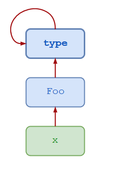

Python’s approach to interface design is somewhat different when compared to languages like Java, Go, and C++. These languages all have an interface keyword, while Python does not. Python further deviates from other languages in one other aspect. It doesn’t require the class that’s implementing the interface to define all of the interface’s abstract methods.

## Reference link 

https://realpython.com/python-interface/

https://realpython.com/oop-in-python-vs-java/

https://realpython.com/python-metaclasses/

https://realpython.com/python3-object-oriented-programming/

https://dbader.org/blog/python-lambda-functions

## `__new__` vs `__init__`

Use `__new__` when you need to control the creation of a new instance.

Use `__init__` when you need to control initialization of a new instance.

`__new__` is the first step of instance creation. It's called first, and is responsible for returning a new instance of your class.

In contrast, `__init__` doesn't return anything; it's only responsible for initializing the instance after it's been created.

In general, you shouldn't need to override `__new__` unless you're subclassing an immutable type like str, int, unicode or tuple.