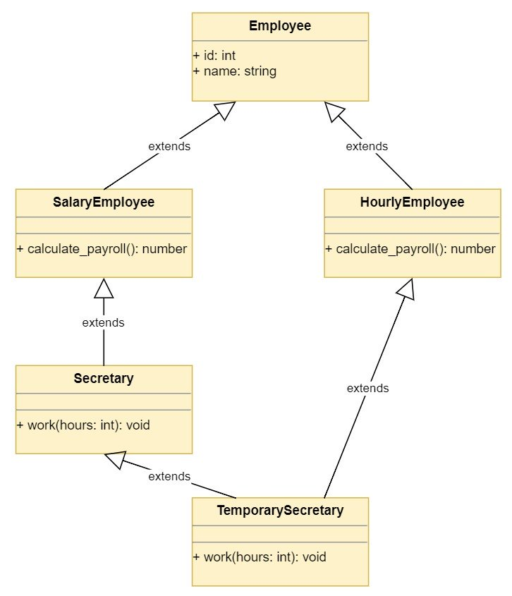

# OOP useful guide and other stuffs ...

***
### *dunder*
https://dbader.org/blog/meaning-of-underscores-in-python

The various meanings and naming conventions around single and double underscores (“dunder”) in Python, how name mangling works and how it affects your own Python classes.

1. Single Leading Underscore: _var

The underscore prefix is meant as a hint to another programmer that a variable or method starting with a single underscore is intended for internal use. This convention is defined in PEP 8.

```
class Test:
    def __init__(self):
        self.foo = 11
        self._bar = 23
```

Python does not have strong distinctions between “private” and “public” variables like Java does.

> “Hey, this isn’t really meant to be a part of the public interface of this class. Best to leave it alone.”

> Single underscores are a Python naming convention indicating a name is meant for internal use. It is generally not enforced by the Python interpreter and meant as a hint to the programmer only.


2. Single Trailing Underscore: var_

Sometimes the most fitting name for a variable is already taken by a keyword. Therefore names like class or def cannot be used as variable names in Python. In this case you can append a single underscore to break the naming conflict:

```
>>> def make_object(name, class):
SyntaxError: "invalid syntax"

>>> def make_object(name, class_):
...     pass
```

In summary, a single trailing underscore (postfix) is used by convention to avoid naming conflicts with Python keywords. This convention is explained in PEP 8.


3. Double Leading Underscore: __var

The naming patterns we covered so far received their meaning from agreed upon conventions only. With Python class attributes (variables and methods) that start with double underscores, things are a little different.

A double underscore prefix causes the Python interpreter to rewrite the attribute name in order to avoid naming conflicts in subclasses.

This is also called name **mangling**—the interpreter changes the name of the variable in a way that makes it harder to create collisions when the class is extended later.

I know this sounds rather abstract. This is why I put together this little code example we can use for experimentation:

```python
class Test:
    def __init__(self):
        self.foo = 11
        self._bar = 23
        self.__baz = 23
```

Let’s take a look at the attributes on this object using the 
built-in `dir()` function:

```
>>> t = Test()
>>> dir(t)
['_Test__baz', '__class__', '__delattr__', '__dict__', '__dir__',
 '__doc__', '__eq__', '__format__', '__ge__', '__getattribute__',
 '__gt__', '__hash__', '__init__', '__le__', '__lt__', '__module__',
 '__ne__', '__new__', '__reduce__', '__reduce_ex__', '__repr__',
 '__setattr__', '__sizeof__', '__str__', '__subclasshook__',
 '__weakref__', '_bar', 'foo']
```

If you look closely you’ll see there’s an attribute called `_Test__baz` on this object.

```python
class ExtendedTest(Test):
    def __init__(self):
        super().__init__()
        self.foo = 'overridden'
        self._bar = 'overridden'
        self.__baz = 'overridden'
```

```
>>> dir(t2)
['_ExtendedTest__baz', '_Test__baz', '__class__', '__delattr__', '__dict__', '__dir__', '__doc__', '__eq__', '__format__', '__ge__', '__getattribute__', '__gt__', '__hash__', '__init__', '__init_subclass__', '__le__', '__lt__', '__module__', '__ne__', '__new__', '__reduce__', '__reduce_ex__', '__repr__', '__setattr__', '__sizeof__', '__str__', '__subclasshook__', '__weakref__', '_bar', 'foo']
>>> t2.foo
'overridden'
>>> t2._bar
'overridden'
>>> t2._
t2._ExtendedTest__baz  t2._Test__baz          t2._bar                
>>> t2._ExtendedTest__baz
'overridden'
>>> t2._Test__baz
23
```

Wait, why did we get that AttributeError when we tried to inspect the value of t2.__baz? Name mangling strikes again! It turns out this object doesn’t even have a __baz attribute:


```
>>> dir(t2)
['_ExtendedTest__baz', '_Test__baz', '__class__', '__delattr__',
 '__dict__', '__dir__', '__doc__', '__eq__', '__format__', '__ge__',
 '__getattribute__', '__gt__', '__hash__', '__init__', '__le__',
 '__lt__', '__module__', '__ne__', '__new__', '__reduce__',
 '__reduce_ex__', '__repr__', '__setattr__', '__sizeof__', '__str__',
 '__subclasshook__', '__weakref__', '_bar', 'foo', 'get_vars']
```


4. Double Leading and Trailing Underscore: __var__

Perhaps surprisingly, name *mangling* is not applied if a name starts and ends with double underscores. Variables surrounded by a double underscore prefix and postfix are left unscathed by the Python interpeter

```python
class PrefixPostfixTest:
    def __init__(self):
        self.__bam__ = 42

>>> PrefixPostfixTest().__bam__
42
```
However, names that have both leading and trailing double underscores are reserved for special use in the language. This rule covers things like __init__ for object constructors, or __call__ to make an object callable.

These dunder methods are often referred to as magic methods—but many people in the Python community, including myself, don’t like that.
http://amontalenti.com/2013/04/11/python-double-under-double-wonder

It’s best to stay away from using names that start and end with double underscores (“dunders”) in your own programs to avoid collisions with future changes to the Python language.


5. Single Underscore: _

Per convention, a single standalone underscore is sometimes used as a name to indicate that a variable is *temporary or insignificant*.

For example, in the following loop we don’t need access to the running index and we can use “_” to indicate that it is just a temporary value:

```python
>>> for _ in range(32):
...     print('Hello, World.')
```

You can also use single underscores in unpacking expressions as a “don’t care” variable to ignore particular values. Again, this meaning is “per convention” only and there’s no special behavior triggered in the Python interpreter. The single underscore is simply a valid variable name that’s sometimes used for this purpose.

In the following code example I’m unpacking a car tuple into separate variables but I’m only interested in the values for color and mileage. However, in order for the unpacking expression to succeed I need to assign all values contained in the tuple to variables. That’s where “_” is useful as a placeholder variable:

```python
>>> car = ('red', 'auto', 12, 3812.4)
>>> color, _, _, mileage = car

>>> color
'red'
>>> mileage
3812.4
>>> _
12
```
Besides its use as a temporary variable, “_” is a special variable in most Python REPLs that represents the result of the last expression evaluated by the interpreter

| #id  | Exmaple    | Pattern	                            | Meaning  |
| ---- | ---        | -------------                          | :-----   |
|   1  |   `_var`         | Single Leading Underscore              | Naming convention indicating a name is meant for internal use. Generally not enforced by the Python interpreter (except in wildcard imports) and meant as a hint to the programmer only. |
|   2  |    `var_`        | Single Trailing Underscore             | Used by convention to avoid naming conflicts with Python keywords |
|   3  |   `__var`         | Double Leading Underscore              | Triggers name mangling when used in a class context. Enforced by the Python interpreter. |
|   4  |   `__var__`         | Double Leading and Trailing Underscore |  Indicates special methods defined by the Python language. Avoid this naming scheme for your own attributes. |
|   5  |   `_`         | Single Underscore                      | Sometimes used as a name for temporary or insignificant variables (“don’t care”). Also: The result of the last expression in a Python REPL. |

   
***
### super


***
### OOP : Inheritance and Composition

https://realpython.com/inheritance-composition-python/

https://realpython.com/primer-on-python-decorators/

https://realpython.com/operator-function-overloading/

https://realpython.com/python-super/

https://realpython.com/python-type-checking/#duck-typing

**Inheritance** models what is called an **is a** relationship. This means that when you have a Derived class that inherits from a Base class, you created a relationship where Derived is a specialized version of Base.


**Composition** is a concept that models a **has a** relationship. It enables creating complex types by combining objects of other types. This means that a class Composite can contain an object of another class Component. This relationship means that a Composite has a Component.

*Implementation Inheritance vs Interface Inheritance*
When you derive one class from another, the derived class inherits both:

1. The base class interface: The derived class inherits all the methods, properties, and attributes of the base class.

2. The base class implementation: The derived class inherits the code that implements the class interface.

When a method or attribute of a class is accessed, Python uses the class MRO to find it. The MRO is also used by super() to determine which method or attribute to invoke. You can learn more about super() in Supercharge Your Classes With Python super().

https://www.python.org/download/releases/2.3/mro/

```python
>>> from employees import TemporarySecretary
>>> TemporarySecretary.__mro__

(<class 'employees.TemporarySecretary'>,
 <class 'employees.HourlyEmployee'>,
 <class 'employees.Secretary'>,
 <class 'employees.SalaryEmployee'>,
 <class 'employees.Employee'>,
 <class 'object'>
)
```

As you can see, multiple inheritance can be confusing, especially when you run into the diamond problem.

The following diagram shows the diamond problem in your class hierarchy:



