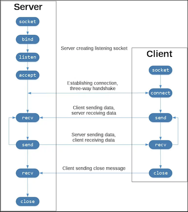
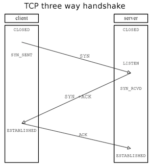
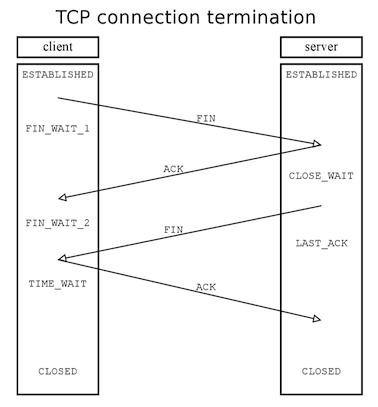

# Socket Programming in Python (Guide)
> by Nathan Jennings  advanced python web-dev

https://realpython.com/python-sockets/

> advanced python web-dev

The orignal examples of this tutorial use Python 3.6. You can find the source code on GitHub.
https://github.com/realpython/materials/tree/master/python-sockets-tutorial

In this repo could find few modifications as comment, print, as so on

The primary socket API functions and methods in this module are:







```python
socket()
bind()
listen()
accept()
connect()
connect_ex()
send()
recv()
close()
```


## Useful links 

https://en.wikipedia.org/wiki/Inter-process_communication

https://en.wikipedia.org/wiki/Berkeley_sockets

https://docs.python.org/3/library/socket.html


## Useful commnad ( on macos )

lsof -nP -i4TCP:$PORT | grep LISTEN

netstat -an -ptcp | grep LISTEN


# Additional resources

https://realpython.com/python-sockets/#reference

