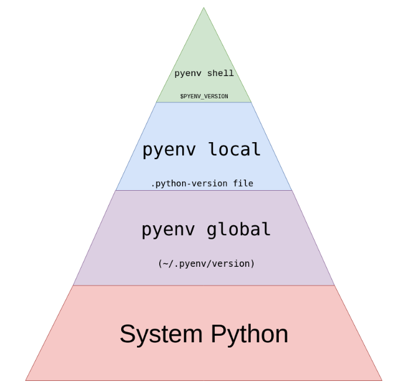

# pyenv
https://realpython.com/intro-to-pyenv/

```bash
(base) pasquales-mbp:WrapperGTW_new pasqualespica$ python -V
Python 3.8.1

(base) pasquales-mbp:WrapperGTW_new pasqualespica$ which python
/Users/pasqualespica/.pyenv/shims/python
```

## Install …
macOS users can use the following command:

```bash
brew install openssl readline sqlite3 xz zlib
```

# Load pyenv automatically by adding
# the following to ~/.bashrc:

```bash
export PATH="$HOME/.pyenv/bin:$PATH"
eval "$(pyenv init -)"
eval "$(pyenv virtualenv-init -)"
```

### Using pyenv to Install Python

```bash
pyenv install --list | grep " 3\.[678]"

pyenv install --list | grep "jython"
```

```bash
$ pyenv install --list
...
```
There are a lot
```bash
…
…
…
```

```bash
pyenv install -v 3.7.2
…
pyenv install 3.8-dev
…
```

### Installation Location
```bash
ls ~/.pyenv/versions/
```

# Remove …
```bash
rm -rf ~/.pyenv/versions/2.7.15
```

Of course pyenv also provides a command to uninstall a particular Python version:
```bash
$ pyenv uninstall 2.7.15
```

### Using Your New Python

```bash
$ pyenv versions
* system (set by /home/realpython/.pyenv/version)
  2.7.15
  3.6.8
  3.8-dev

$ python -V
Python 2.7.12

$ which python
/home/realpython/.pyenv/shims/python

$ pyenv which python
/usr/bin/python
```

If, for example, you wanted to use version 2.7.15, then you can use the global command:

```bash

$ pyenv global 2.7.15
$ python -V
Python 2.7.15

$ pyenv versions
  system
* 2.7.15 (set by /home/realpython/.pyenv/version)
  3.6.8
  3.8-dev
```

If you ever want to go back to the system version of Python as the default, you can run this:

```bash
$ pyenv global system
$ python -V
Python 2.7.12
```

## Exploring pyenv Commands
pyenv offers many commands. You can see a complete list of all available commands with this:
```bash
$ pyenv commands
activate
commands
completions
deactivate
...
virtualenvs
whence
which
```


`local`
The local command is often used to set an application-specific Python version. You could use it to set the version to 2.7.15:
```bash
$ pyenv local 2.7.15
```
This command creates a .python-version file in your current directory. If you have pyenv active in your environment, this file will automatically activate this version for you.

`shell`
The shell command is used to set a shell-specific Python version. For example, if you wanted to test out the 3.8-dev version of Python, you can do this:
```bash
$ pyenv shell 3.8-dev
```

### Specifying Your Python Version



This pyramid is meant to be read from top to bottom. The first of these options that pyenv can find is the option it will use. Let’s see a quick example:
